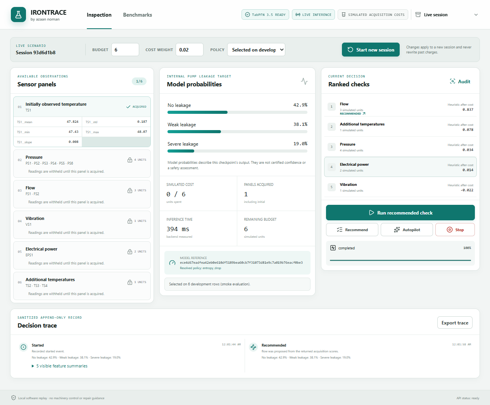

# IRONTRACE

IRONTRACE is a local hydraulic inspection replay console. It uses the official TabPFN 3.5 base checkpoint to predict internal pump leakage (no, weak, or severe) while simulating the cost of buying access to additional sensor panels. It does not operate machinery and it does not provide repair or safety decisions.

The public product name is IRONTRACE. Internal Python modules and the compatibility environment variable `NEXTCHECK_ARTIFACTS` still use `nextcheck`/`NEXTCHECK` names.



For an agent to set up and run the clone, use the [AI agent runbook](docs/codex-agent-setup.md).

## Ask an agent to run it

Open the cloned folder in Codex or another agent and paste this prompt:

```text
Work in this cloned IRONTRACE repository. Read AGENTS.md and docs/codex-agent-setup.md first. Set up, prepare data, prepare the official model, run the doctor, start one local worker, and verify the app. Use only .venv and the exact repository commands. You may run setup and verification autonomously; pause only when the official gated TabPFN terms require me to review/accept them or when Hugging Face authentication is required. If access is denied, tell me to run .\.venv\Scripts\hf.exe auth login, then continue.

After setup, open http://127.0.0.1:8000 and check Inspection and Benchmarks. For a fresh clone, choose Information for the first session because value policies depend on generated artifacts. Test Recommend, Audit, Run recommended check, Autopilot, and Stop/report. For complete verification, run the documented smoke utility/evaluation commands, restart the server, record a replay, and run verify_live.py from a second terminal. Report exact commands, files inspected/changed, results, blockers, and remaining risk. Do not invent performance claims or expose credentials, hidden readings, test labels before termination, model weights, or private cache paths. Stop the server before direct model commands (doctor, pytest, utility fitting, evaluation); keep it running for browser checks, record_demo.py, and verify_live.py, which use its API.
```

## Windows quick start

These instructions assume Windows PowerShell and a clone of this repository.

The tested hardware is an NVIDIA RTX 4060 Ti with 8 GB VRAM. The locked installation uses CUDA 12.8 PyTorch; CPU-only, macOS, and Linux setups have not been validated. Allow several GB for dependencies, plus the approximately 836 MiB model and downloaded dataset. Model inference runs locally after preparation.

1. Install [Git](https://git-scm.com/download/win), [uv](https://docs.astral.sh/uv/getting-started/installation/), and [Node.js](https://nodejs.org/en/download) (22.12 or newer; Node 24 is validated). The project requires Python 3.11; `uv` creates the environment. Check the tools:

   ```powershell
   git --version
   uv --version
   node --version
   npm.cmd --version
   ```

2. Clone and enter the repository:

   ```powershell
   git clone https://github.com/iecclodd/irontrace.git
   Set-Location irontrace
   ```

3. Install locked dependencies and build the console:

   ```powershell
   .\setup.ps1
   ```

   Setup creates `.venv` with Python 3.11, installs `backend/requirements.lock` with the CUDA 12.8 PyTorch index, installs the backend package, runs `npm.cmd --prefix frontend ci`, and builds the frontend. It can take several minutes and needs internet access.

4. Prepare official UCI 447 data:

   ```powershell
   .\.venv\Scripts\python.exe scripts/prepare_data.py
   ```

   This downloads and validates the official archive, extracts required files, creates row-local features, and writes frozen context/utility/selection/test splits under `artifacts/data`.

5. Prepare the model checkpoint:

   ```powershell
   .\.venv\Scripts\python.exe scripts/prepare_model.py
   ```

   This resolves the official TabPFN 3.5 checkpoint and downloads it through `huggingface_hub` using local Hugging Face authentication. The file is about 836 MiB (876,027,932 bytes), so allow disk space and download time. Review and accept the [official gated model terms](https://huggingface.co/Prior-Labs/tabpfn_3_5) yourself before running it. The command does not accept terms, request tokens, or copy credentials. If access is denied, run `.\.venv\Scripts\hf.exe auth login`, complete authorization at Hugging Face, and run the command again. Weights remain in the external cache.

6. Run the real model doctor:

   ```powershell
   .\.venv\Scripts\python.exe scripts/doctor.py
   ```

   A successful run performs one held-out development prediction and writes `artifacts/model_status.json`. The first model load can take a few minutes. A failed doctor exits nonzero and prints the blocker.

7. Start IRONTRACE:

   ```powershell
   .\start.ps1
   ```

   Open **http://127.0.0.1:8000**. Wait for the readiness badge to say the model is ready. The server loads one model worker. Stop it with `Ctrl+C`. `start.ps1` uses only this clone's `.venv`; if it says `Run setup.ps1 first`, return to step 3.

## First inspection

The console opens on **Inspection**. Select a budget and cost weight, then choose a policy. **Selected on development data (recommended)** uses the frozen development choice when matching artifacts are available. Other choices include Information, Empirical value, Value without residual, Entropy drop, Raw KL, Random, Static, Prior only, and All panels. Start with budget `6` and cost weight `0.02` for the delivered smoke example.

Click **Start live session**. Initial TS1 summaries are visible. Locked panels show names and simulated prices; hidden readings and the historical label stay unavailable until the corresponding action or terminal report. On a fresh clone, choose **Information** for the first session: the recommended default may fall back, and value policies are unavailable until `prepare_utility.py` has generated matching artifacts.

To work manually, click **Recommend** and inspect ranked checks. Clicking a candidate opens its **Audit** details; it does not select a buy target. **Run recommended check** always buys the currently recommended candidate, charges its simulated cost, and updates probabilities. A recommendation may be to stop; do not invent a purchase reason. The **Audit** drawer explains candidate score, raw KL, residual, and predicted one-step value. Disagreement is a diagnostic, not proof that a prediction is wrong.

**Autopilot** runs the bounded acquisition loop. **Stop** ends a live session manually and produces the terminal report; the report can reveal the historical label and the session cannot resume acquisition. Use **Export trace** for the sanitized append-only decision trace.

Use the top selector for **Live session** or a recorded development replay. A replay is marked **RECORDED REPLAY**; its controls and branch actions are disabled. Replay data is sanitized and does not expose raw row indices or hidden readings.

Open **Benchmarks** to inspect persisted evaluation results. The screen reads actual `artifacts/run_*` files and does not generate sample metrics. A fresh clone has no generated artifacts until you run preparation and evaluation. Filter by budget and cost weight. Read scope, status, split counts, model reference, class support, log loss, mean simulated cost, accuracy, and acquisition counts together. The delivered run is an explicitly labeled 8-case smoke evaluation; the full capped 80-utility/80-selection/120-test study has not been run.

## Quick smoke and full study

Run the smoke path as a separate, optional study after stopping the server with `Ctrl+C`:

```powershell
.\.venv\Scripts\python.exe scripts/prepare_utility.py --smoke --context-limit 240 --utility-limit 6 --selection-limit 6
.\.venv\Scripts\python.exe scripts/evaluate.py --smoke --context-limit 240 --utility-limit 6 --selection-limit 6 --test-limit 8 --budgets 0 2 4 6 8 11 --lambdas 0 .005 .01 .02 .05 .1
```

The full capped study is a separate, optional longer run:

```powershell
.\.venv\Scripts\python.exe scripts/prepare_utility.py
.\.venv\Scripts\python.exe scripts/evaluate.py
```

After either run, run `.\start.ps1` again in the first terminal. In a second PowerShell terminal, enter the same cloned directory and record an illustrative development replay while the server keeps running:

```powershell
.\.venv\Scripts\python.exe scripts/record_demo.py
```

Reload the browser to see the new replay in the top selector. Smoke and full runs can take minutes or longer depending on GPU, cache state, and model initialization. Keep one GPU process only: stop the server before doctor, pytest, utility fitting, or evaluation; keep it running for `record_demo.py` and `verify_live.py`, which call its API. Restart IRONTRACE after preparing utility artifacts so the worker revalidates model and utility identities. Run `--help` on each script for options. `NEXTCHECK_ARTIFACTS` remains a compatibility override for artifact location; scripts do not load `.env` automatically. To set it for one PowerShell process, use `$env:NEXTCHECK_ARTIFACTS = 'C:\path\to\artifacts'`. Use the default location for `record_demo.py` and `verify_live.py`, which write to the repository's `artifacts/` directory.

## Frontend development and health checks

Run the backend in one PowerShell window and the Vite dev server in another:

```powershell
# Terminal 1: keep this running
.\start.ps1
```

```powershell
# Terminal 2: from the same repository
npm.cmd --prefix frontend run dev
```

The Vite URL is http://127.0.0.1:5173 and proxies `/api` to port 8000. Check health at http://127.0.0.1:8000/api/health. To use another backend port, run `.\start.ps1 -Port 8010`; the Vite proxy remains configured for the documented port. If PowerShell blocks a script, run `powershell.exe -NoProfile -ExecutionPolicy Bypass -File .\setup.ps1` for that process. Restart by stopping the server with `Ctrl+C` and running `start.ps1` again.

## Verification commands

With the backend stopped:

```powershell
.\.venv\Scripts\python.exe -m pytest backend/tests -q
npm.cmd --prefix frontend run build
```

For all eight live acceptance groups, first complete the data/model quick start and the **smoke utility + evaluation commands above**. The check deliberately requires real value models, a complete benchmark, and a recorded replay; an empty fresh clone will not pass it.

```powershell
# Terminal 1: start the backend and leave it running
.\start.ps1
```

```powershell
# Terminal 2: enter the same cloned folder first
.\.venv\Scripts\python.exe scripts/record_demo.py
.\.venv\Scripts\python.exe scripts/verify_live.py
```

The live check should finish with `"status": "passed"` and `"checks": 8`. It calls the running backend rather than loading another model. Afterward, browse the app or stop Terminal 1 with `Ctrl+C`.

Publication checks recorded **52 backend tests passed with no integration skip**, a passing frontend build, and eight live acceptance groups against actual TabPFN 3.5. See [release verification](docs/PUBLIC_RELEASE.md). Without prepared data, the real-model integration test skips; a skip is not a verified inference result.

## Troubleshooting

- **A tool is not recognized:** install Git, `uv`, and Node.js 22.12+; open a new PowerShell window and rerun version checks.
- **Torch installation fails:** keep the locked CUDA 12.8 index from `setup.ps1`, confirm network access, and rerun setup.
- **Data preparation fails:** use the official download, or pass raw files with `scripts/prepare_data.py --raw-dir C:\path\to\raw-sensors`.
- **Model access is denied:** review and accept official terms, run `.\.venv\Scripts\hf.exe auth login`, and rerun `prepare_model.py`.
- **Doctor reports no checkpoint:** fix model access/cache permissions, rerun `prepare_model.py`, then `doctor.py`.
- **Live inference is unavailable:** check PowerShell output, confirm `artifacts/data` and `artifacts/model_status.json`, then press **Recheck**.
- **Benchmarks are empty:** run `prepare_utility.py` and `evaluate.py`; the screen only displays persisted results.
- **A session action fails:** read the red action error, check remaining budget and readiness, and start a new session if artifacts or model identity changed.

## Evidence, licenses, and limits

The source dataset is UCI dataset 447, *Condition monitoring of hydraulic systems*, by Helwig, Pignanelli, and Schütze (2015), under CC BY 4.0. See [SOURCES.md](SOURCES.md). The TabPFN 3.5 checkpoint has separate noncommercial terms; review the official model card and terms yourself. Contest or commercial permission is not asserted. No project-specific software license is included in this release. Dataset and model terms are separate; see [SOURCES.md](SOURCES.md).

The recorded checkpoint is `tabpfn-v3.5-20260909.safetensors`; its hash and provenance are retained in a locally generated `artifacts/model_status.json` and the build report. `artifacts/` is generated locally and is not included in a fresh clone. The build report describes a historical local smoke run; it does not bundle runtime outputs. Smoke results do not establish generalization, calibration, or adaptive-policy advantage. One rig and pragmatic block grouping do not prove independent samples. Temporal stress testing, larger-draw sensitivity, bootstrap sensitivity, cross-machine validation, hardware deployment, and the full capped study remain outside the delivered evidence.

## Repository map

`backend/nextcheck/` contains API, state machine, data, model, acquisition, replay, storage, and evaluation modules. `frontend/` contains the console. `scripts/` contains reproducible commands. `demo_manifest.json` defines panels, features, and costs. Runtime artifacts, weights, credentials, full data, environments, and `node_modules` stay out of Git.
